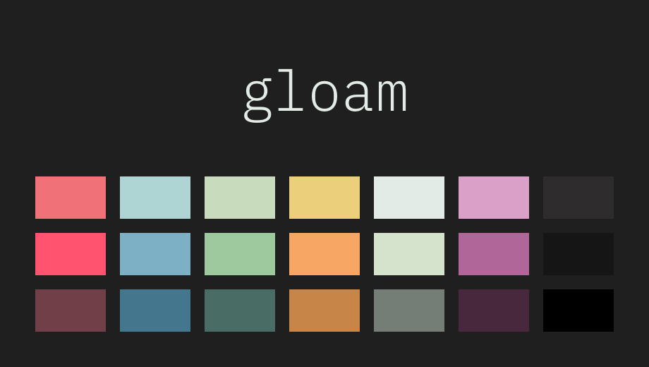

# 🎨 gloam



A cool, moody colorscheme for [iTerm2](https://www.iterm2.com/).

## Table of contents

* [gloam](#-gloam)
  * [Table of Contents](#table-of-contents)
  * [Prior Art](#prior-art)
  * [Installation](#installation)
  * [Roadmap](#roadmap)
  * [Contibuting](#contibuting)
  * [License](#license)

## Prior Art

gloam is heavily based on two of my favorite colorschemes,
[tender](https://github.com/jacoborus/tender.vim) and
[Greenery](https://github.com/Jaredk3nt/nova-theme). In fact, it’s
essentially a palette swap of tender, using mostly the Greenery colors.
The [gloam header image](https://github.com/ngscheurich/gloam-vim) is a direct
remix of [tender’s](https://github.com/ngscheurich/gloam-vim).

Many thanks to [@jacoborus](https://github.com/jacoborus/) and
[@Jaredk3nt](https://github.com/Jaredk3nt) for their hard work!

## Installation

Simply download [gloam.itermcolors](https://raw.githubusercontent.com/ngscheurich/gloam-iterm2/master/gloam.itermcolors)
and double-click it to import it to iTerm2. Alternatively, select the file from
iTerm2 > Preferences > Profiles > [some profile] > Color Presets > Import.

Here’s a shell one-liner in case you’re into that sort of thing

```sh
$ cd /tmp && curl -LO https://raw.githubusercontent.com/ngscheurich/gloam-iterm2/master/gloam.itermcolors \
  && open gloam.itermcolors && cd -
```

## Contributing

Want to contribute? Awesome! Contributions are always welcome—just be sure to
read and follow the [code of conduct](https://github.com/ngscheurich/gloam-iterm2/blob/master/CODE_OF_CONDUCT.md).

## License

This project is released under the [MIT license](https://github.com/ngscheurich/gloam-iterm2/blob/master/LICENSE).
